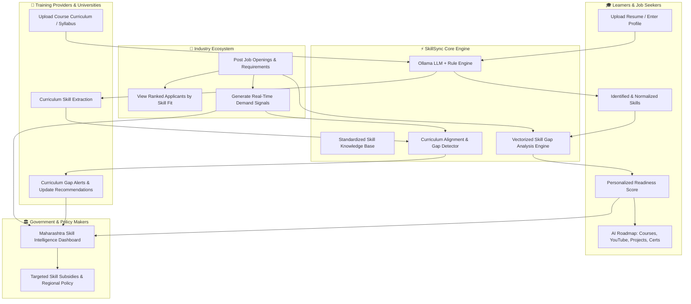

# SkillSync — Maharashtra Skill Intelligence Platform

**SIH 2026 · Problem Statement ID: SIH26134**  
*A Next-Generation Workforce Alignment Engine Connecting Industry Demand, Training Programs, Learners, and Policy Makers.*

---

## 🌟 Executive Summary & Platform Philosophy

Traditional job portals only connect candidates to open positions, ignoring the root causes of unemployment and underemployment: **the widening gap between industry requirements and educational training curricula**.

**SkillSync** is built on a continuous, closed-loop workforce intelligence model:

> **"Our platform continuously compares what industries need with what learners and training programs currently provide.**  
> A learner uploads their resume, our AI identifies their skills, and when they select a target job, we compare their profile with the job's requirements to pinpoint exact skill gaps. Our Ollama-based AI assistant then recommends tailored learning pathways—including curated courses, recognized certifications, high-impact YouTube tutorials, hands-on real-world projects, and personalized learning roadmaps.  
> On the industry side, businesses post job roles and review candidates ranked by skill-profile relevance. Crucially, these job requirements are ingested as real-time industry-demand data, allowing our engine to detect emerging skills, project hiring trends, and highlight where training curricula are falling behind market realities.  
> **We are not just connecting candidates with jobs — we are continuously aligning learners, training programs, and industry requirements."**

---

## 🔄 The Closed-Loop Alignment Architecture



---

## 🚀 Key Capabilities

### 1. 🎓 For Learners
- **AI-Powered Resume Parsing**: Upload PDF/text resumes to automatically extract technical proficiencies, frameworks, soft skills, and years of experience.
- **Dynamic Skill Gap Analysis**: Select any live industry job to see an instant breakdown of matching skills vs. critical missing competencies.
- **Readiness Scoring**: Calculated match percentage based on required core skills, secondary tools, and industry benchmarks.
- **Ollama AI Career Assistant**: Powered by local LLM (`llama3.2:3b` / `llama3`), generating customized learning plans:
  - 🎓 **Accredited Courses**: Coursera, edX, NPTEL, Udemy.
  - 🎥 **Targeted YouTube Playlists**: High-yield video resources for quick concept mastery.
  - 🛠️ **Practical Projects**: Step-by-step project briefs to build portfolio-grade evidence.
  - 📜 **Industry Certifications**: Recognized credentials (AWS, Google, CKA, etc.).
  - 🗺️ **Milestone Roadmaps**: Phase-by-phase timeline to reach 100% job readiness.

### 2. 🏢 For Industry Partners
- **Job Posting & Requirement Spec**: Define required skills, proficiency levels (Beginner, Intermediate, Advanced), and experience brackets.
- **Skill-Ranked Applicant Matching**: Review applicants sorted by their verified skill compatibility, eliminating manual resume filtering.
- **Demand Signaling**: Every published job dynamically updates state-level industry demand databases, signaling hiring surges and emerging tech stacks.

### 3. 🏫 For Training Providers & Academia
- **Curriculum Upload & Auditing**: Ingest syllabi and program course descriptions.
- **Market Alignment Scoring**: Automatically detect outdated modules and subjects where training lags behind current industry job postings.
- **Curriculum Modernization Insights**: AI-generated suggestions on what modern libraries, tools, and methodologies should be added to maintain graduate employability.

### 4. 🏛️ For Government & Policy Planners (Maharashtra Focus)
- **Macro Workforce Intelligence**: Real-time cross-ecosystem analytics across Pune, Mumbai, Nagpur, Nashik, Aurangabad, and rural districts.
- **Supply vs. Demand Heatmaps**: Discover critical shortages (e.g., Cloud Engineers, Embedded Systems, AI/ML) before they impact state economic development.
- **Evidence-Based Policy Interventions**: Allocate vocational training funds and apprenticeship initiatives where industry demand is highest.

---

## 🛠️ Technology Stack

| Layer | Technology | Purpose |
|---|---|---|
| **Frontend** | React 19, Vite, Tailwind CSS v4, Lucide React, Recharts | Fast, responsive, modern glassmorphic dashboard experience |
| **Backend API** | Node.js, Express 5, MongoDB Driver, JWT, Bcrypt | Secure RESTful API, role-based access control, transaction management |
| **Database** | MongoDB 6+ | Flexible document storage for profiles, jobs, curricula, skills, and analytics |
| **AI / NLP Service** | Python 3.10+, FastAPI, Uvicorn, Pydantic, HTTPX | Microservice for document analysis, resume processing, and roadmap generation |
| **Local LLM** | Ollama (`llama3.2:3b` or `llama3`) | Private, fast, locally-hosted LLM with graceful fallback to semantic rule engines |
| **Dev Tooling** | Concurrently, Nodemon, Node Test Runner | High-efficiency developer experience and automated smoke/permission tests |

---

## 🔑 Pre-Seeded Demo Accounts

To immediately test the end-to-end workflow without manual data entry, run the seed script:
```bash
npm run seed
```

| Persona | Email | Password | Role | Primary Features to Explore |
|---|---|---|---|---|
| **Learner** | `arjun@learner.com` | `Learner@123` | Learner (`/student`) | Resume parsing, skill gap against SDE role, Ollama learning plan, YouTube links & project roadmap |
| **Industry Partner** | `abc@company.com` | `Company@123` | Industry (`/industry`) | Active SDE job opening, applicant skill ranking, post new jobs, real-time demand signals |
| **Training Provider** | `training@demo.com` | `Training@123` | Training (`/training`) | Software Engineering curriculum, syllabus alignment scores, missing skills alert |
| **Government Admin** | `admin@gov.in` | `Gov@12345` | Government (`/government`) | Maharashtra district heatmaps, talent supply vs. demand trends, policy reporting |

---

## 📂 Project Structure

```
SIH26134/
├── backend/
│   ├── app.js                   # Express application factory & middleware setup
│   ├── server.js                # HTTP server bootstrap & MongoDB connection
│   ├── db.js                    # MongoDB client & collection index initializations
│   ├── config/env.js            # Centralized environment variable validation
│   ├── middleware/
│   │   ├── auth.js              # JWT verification & role-based route guard
│   │   └── errorHandler.js      # Global API error formatting
│   ├── routes/
│   │   ├── auth.js              # Authentication (register, login, session)
│   │   ├── profiles.js          # Role-specific profile management
│   │   ├── skills.js            # Standardized skill taxonomy & ontology
│   │   ├── industry.js          # Industry profiles & company details
│   │   ├── jobs.js              # Job listings, applicant matching & filtering
│   │   ├── training.js          # Institutions, training programs & curricula
│   │   ├── process.js           # Resume & document intake (routes to AI service)
│   │   ├── normalize.js         # Skill extraction & canonical normalization
│   │   ├── match.js             # Skill gap calculation & matching engine
│   │   ├── studentReadiness.js  # Learner readiness calculation
│   │   ├── recommendations.js   # Course, certification & resource recommendations
│   │   ├── roadmap.js           # Personalized AI milestone learning plans
│   │   ├── alignment.js         # Curriculum vs. Industry alignment analytics
│   │   ├── demand.js            # Market skill demand trends & signals
│   │   ├── govIntelligence.js   # State-level supply/demand macro analytics
│   │   └── reportsNotifications.js # Automated PDF/CSV reports & alerts
│   └── services/
│       ├── aiService.js         # HTTP client communicating with Python FastAPI
│       ├── normalization.js     # Normalization & canonical aliases dictionary
│       └── matcher.js           # Vectorized skill match & gap detection algorithms
│
├── frontend/
│   ├── index.html               # Single-page application entry HTML
│   ├── main.jsx                 # React root, routing & authentication context
│   ├── App.jsx                  # Main application shell & global navigation
│   ├── api.js                   # Axios HTTP client with interceptors for JWT
│   ├── routePermissions.js      # Declarative RBAC route permissions
│   └── components/
│       ├── AuthGate.jsx         # Modern login / registration portal
│       ├── StudentDashboard.jsx # Resume upload, target job selection, gap visualization
│       ├── IndustryDashboard.jsx# Job posting, applicant skill profile viewer
│       ├── TrainingDashboard.jsx# Syllabus comparison & curriculum modernization
│       ├── GovernmentDashboard.jsx# Regional gap heatmaps & workforce distribution
│       ├── AIIntelligence.jsx   # Live telemetry for Ollama & rule-based pipeline
│       ├── AnalyticsDashboard.jsx# Cross-ecosystem telemetry & charts
│       ├── ReportsCenter.jsx    # Exportable workforce & alignment reports
│       └── SkillMatchingDashboard.jsx # Interactive skill explorer & normalizer
│
├── ai_service/
│   ├── main.py                  # FastAPI application with REST endpoints
│   ├── app.py                   # Uvicorn entry point with auto-reload
│   ├── ollama_client.py         # Resilient Ollama client with prompt templates
│   ├── rule_extractor.py        # High-performance rule-based fallback extractor
│   ├── requirements.txt         # Python dependencies
│   └── README.md                # AI service standalone instructions
│
├── tests/
│   ├── seed-demo-data.mjs       # Pre-loads realistic demo ecosystem data
│   ├── e2e-smoke.mjs            # Complete end-to-end user journey smoke test
│   ├── security-permissions.test.mjs # Validates role boundaries & auth guards
│   └── verify-b3.mjs to b18.mjs # Granular verification scripts for every module
│
├── .env.example                 # Example configuration template
├── package.json                 # Node scripts & dependencies
└── vite.config.js               # Vite bundler & backend reverse-proxy config
```

---

## ⚙️ Prerequisites

Ensure the following runtimes and tools are installed on your system:

| Dependency | Minimum Version | Download Link | Notes |
|---|---|---|---|
| **Node.js** | `v18.0.0+` | [nodejs.org](https://nodejs.org/) | Runtime for Backend and Vite frontend |
| **Python** | `3.10+` | [python.org](https://www.python.org/) | Runtime for the AI Service |
| **MongoDB** | `v6.0+` | [mongodb.com](https://www.mongodb.com/try/download/community) | Local or MongoDB Atlas cluster |
| **Ollama** *(Recommended)* | Latest | [ollama.com](https://ollama.com/) | For local LLM processing (`llama3.2:3b`) |

> **Note on Ollama**: If you do not have Ollama installed or running, the AI service will **automatically and safely fall back** to its comprehensive built-in semantic rule engine, ensuring 100% platform availability.

---

## 💻 Step-by-Step Installation & Execution Guide

### Step 1: Clone the Repository & Install Node Dependencies

Open your terminal in the project root directory:

```bash
cd SIH26134

# Install frontend and backend dependencies
npm install
```

---

### Step 2: Configure Environment Variables

Create your local `.env` file from the provided template:

**On Windows (PowerShell / Command Prompt):**
```cmd
copy .env.example .env
```

**On Linux / macOS:**
```bash
cp .env.example .env
```

Review your `.env` settings (default values work out-of-the-box for local development):
```env
# Backend Server
PORT=4000
MONGODB_URI=mongodb://127.0.0.1:27017
MONGODB_DB_NAME=SIH26134
JWT_SECRET=super-secret-skillsync-jwt-token-2026
JWT_EXPIRES_IN=24h

# Python AI Service
AI_SERVICE_URL=http://localhost:8000
AI_SERVICE_PORT=8000
AI_SERVICE_TIMEOUT_MS=30000
AI_SERVICE_LOG_LEVEL=info
AI_SERVICE_RELOAD=true

# Ollama LLM Configuration
OLLAMA_BASE_URL=http://localhost:11434
OLLAMA_MODEL=llama3.2:3b
```

---

### Step 3: Start MongoDB

Ensure your local MongoDB service is running:

- **Windows (Service)**: Usually starts automatically. Or run `net start MongoDB` in an administrator prompt.
- **macOS (Homebrew)**: `brew services start mongodb-community`
- **Linux (systemd)**: `sudo systemctl start mongod`

---

### Step 4: Setup the Python AI Service & Ollama

1. **Install Python virtual environment & packages:**
   ```bash
   cd ai_service
   python -m venv venv
   ```
   - **Windows**: `venv\Scripts\activate`
   - **Linux/macOS**: `source venv/bin/activate`

   ```bash
   pip install -r requirements.txt
   cd ..
   ```

2. **Pull the Ollama Model (Recommended):**
   Open a separate terminal window:
   ```bash
   ollama pull llama3.2:3b
   ```
   *(Or `ollama pull llama3` if preferred. Ollama runs on `http://localhost:11434`)*

---

### Step 5: Seed Demo Ecosystem Data

Populate the database with pre-configured jobs, candidate resumes, training curricula, and skills:

```bash
npm run seed
```

*(This creates the demo accounts: `arjun@learner.com`, `abc@company.com`, `training@demo.com`, `admin@gov.in`)*

---

### Step 6: Execute the Application

You can execute the system using either the **One-Command Concurrent Launcher** or by starting each service in its own terminal.

#### Option A: One-Command Concurrent Execution (Frontend + Backend)

In your root directory terminal:
```bash
npm run dev
```
> This concurrently boots:
> - **Express Backend API** on `http://localhost:4000`
> - **Vite React Frontend** on `http://localhost:5173`

In a second terminal, activate your virtual environment and start the AI service:
```bash
cd ai_service
python app.py
```
> Boots the **FastAPI AI Engine** on `http://localhost:8000`

---

#### Option B: Running Each Service Separately (Recommended for Debugging)

**Terminal 1 — Backend API (Express):**
```bash
npm run server
```
*Listens on: `http://localhost:4000`*

**Terminal 2 — Frontend UI (Vite + React):**
```bash
npm run client
```
*Listens on: `http://localhost:5173`*

**Terminal 3 — AI Service (FastAPI + Ollama):**
```bash
cd ai_service
python app.py
```
*Listens on: `http://localhost:8000`*

**Terminal 4 — Ollama Engine (if not running as background service):**
```bash
ollama serve
```
*Listens on: `http://localhost:11434`*

---

### Step 7: Access the Platform

Open your browser and navigate to:

👉 **[http://localhost:5173](http://localhost:5173)**

Log in with any of the demo accounts listed above (e.g. `arjun@learner.com` / `Learner@123` for the Learner experience or `abc@company.com` / `Company@123` for Industry).

---

## 🧪 Verification & Automated Tests

To ensure all role permissions, database connections, and AI pipeline integrations are healthy:

```bash
# Run End-to-End Smoke Test
npm run test:e2e

# Run Security & Role-Based Access Control Tests
npm run test:permissions

# Run Authentication & Session Tests
npm run test:auth
```

You can also run granular tests for individual backend subsystems:
```bash
node tests/verify-b3.mjs   # Profiles & RBAC
node tests/verify-b5.mjs   # Jobs & Industry Demand
node tests/verify-b7.mjs   # Document Parsing & AI Extraction
node tests/verify-b9.mjs   # Skill Normalization & Gap Analysis
node tests/verify-b11.mjs  # Recommendation Scoring
node tests/smoke-b12-b18.mjs # Roadmaps, Alignment & Reports
```

---

## 🔗 Key API Endpoints Reference

| Method | Endpoint | Description | Guard |
|---|---|---|---|
| `POST` | `/api/auth/login` | Authenticates user & returns JWT | Public |
| `POST` | `/api/auth/register` | Registers new user with specific role | Public |
| `POST` | `/api/process/resume` | Ingests resume text/PDF & extracts skills via AI | Learner |
| `GET` | `/api/jobs` | Retrieves live industry job postings | Authenticated |
| `POST` | `/api/jobs` | Publishes a new industry job & updates demand signals | Industry |
| `POST` | `/api/match/gap` | Calculates skill gaps between candidate & target job | Learner |
| `POST` | `/api/roadmap/generate` | Generates Ollama AI learning plan & resources | Learner |
| `GET` | `/api/training/programs` | Retrieves training programs & syllabi | Authenticated |
| `POST` | `/api/alignment/check` | Compares curriculum against industry demand | Training / Gov |
| `GET` | `/api/demand/trends` | High-demand skills & emerging tech analytics | All Roles |
| `GET` | `/api/gov/macro-overview`| State-wide supply vs demand workforce intelligence | Government |
| `GET` | `/api/health` | Backend and database health status | Public |

---

## 🛡️ Security & Architecture Best Practices

- **Zero Client-Side Secret Exposure**: No database strings or private tokens are leaked to the Vite bundle.
- **Strict Role-Based Access Control (RBAC)**: Enforced both on the client via dynamic routing permissions and on the backend via cryptographic JWT claims.
- **Graceful Degradation**: If Ollama or AI microservices encounter latency or timeouts, the platform gracefully switches to deterministic semantic rule matching without interrupting user operations.
- **Privacy First**: Learner resumes and industry job descriptions are processed on your local machine using local LLMs, preserving data sovereignty.

---

## 👥 Contributors — Team SkillSync

Designed to bridge the gap between education and employment across the State of Maharashtra and beyond.
